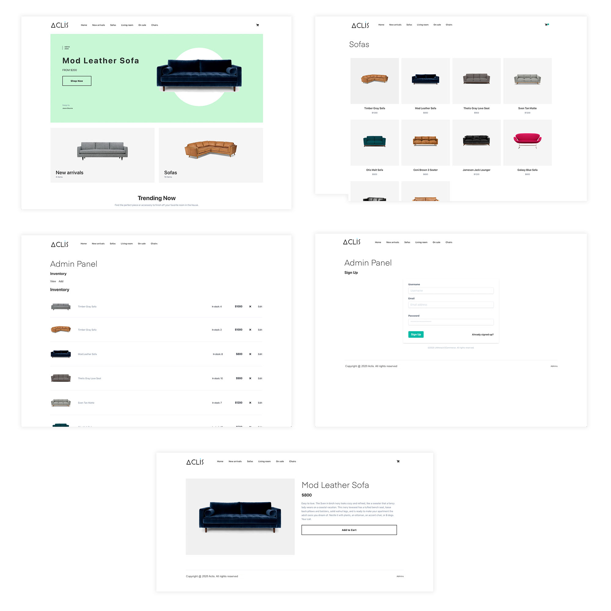

## Aclis E Commerce Professional

> This is a repo of [Aclis ECommerce](https://aclis.africa).


This site uses completely static data coming from a provider at `providers/inventoryProvider.js`. You can update this provider to fetch data from any real API by changing the call in the `getInventory` function.



> This project is still WIP.

### Getting started

1. Clone the project

```sh
$ git clone https://github.com/gatarelib/gatsby-e-com
```

2. Install the dependencies:

```sh
$ yarn

# or

$ npm install
```

3. Run the project

```sh
$ gatsby develop

# or to build

$ gatsby build
```

### Configuring inventory provider

Update __providers/inventoryProvider.js__ with your own inventory provider.

### Updating with Auth / Admin panel

1. Update __src/pages/admin.js__ with sign up, sign, in, sign out, and confirm sign in methods.

2. Update __src/templates/ViewInventory.js__ with methods to interact with the actual inventory API.

3. Update __src/components/formComponents/AddInventory.js__ with methods to add item to actual inventory API.

### Roadmap for V1

- Add ability to specify quantities in cart
- Auto dropdown navigation for large number of categories
- Ability to add more / more configurable metadata to item details
- Themeing + dark mode
- Better image support out of the box
- Optional user account / profiles out of the box
- Have an idea or a request? Submit [an issue](https://github.com/gatarelib/gatsby-e-com/issues) or [a pull request](https://github.com/gatarelib/gatsby-e-com/pulls)!

### Other considerations

#### Images

If you're using dynamic images over http, you can add a build step into `exports.createPages` in __gatsby-node.esm.js__ to download the images locally to improve the user experience. You can also add a placeholder image in __src/components/Image.js__ or make some adjustments in that component for other image loading enhancements.   

#### Server-side processing of payments
To see an example of how to process payments server-side with stripe, check out the Lambda function in the snippets folder.

Also, consider verifying totals by passing in an array of IDs into the function, calculating the total on the server, then comparing the totals to check and make sure they match.
